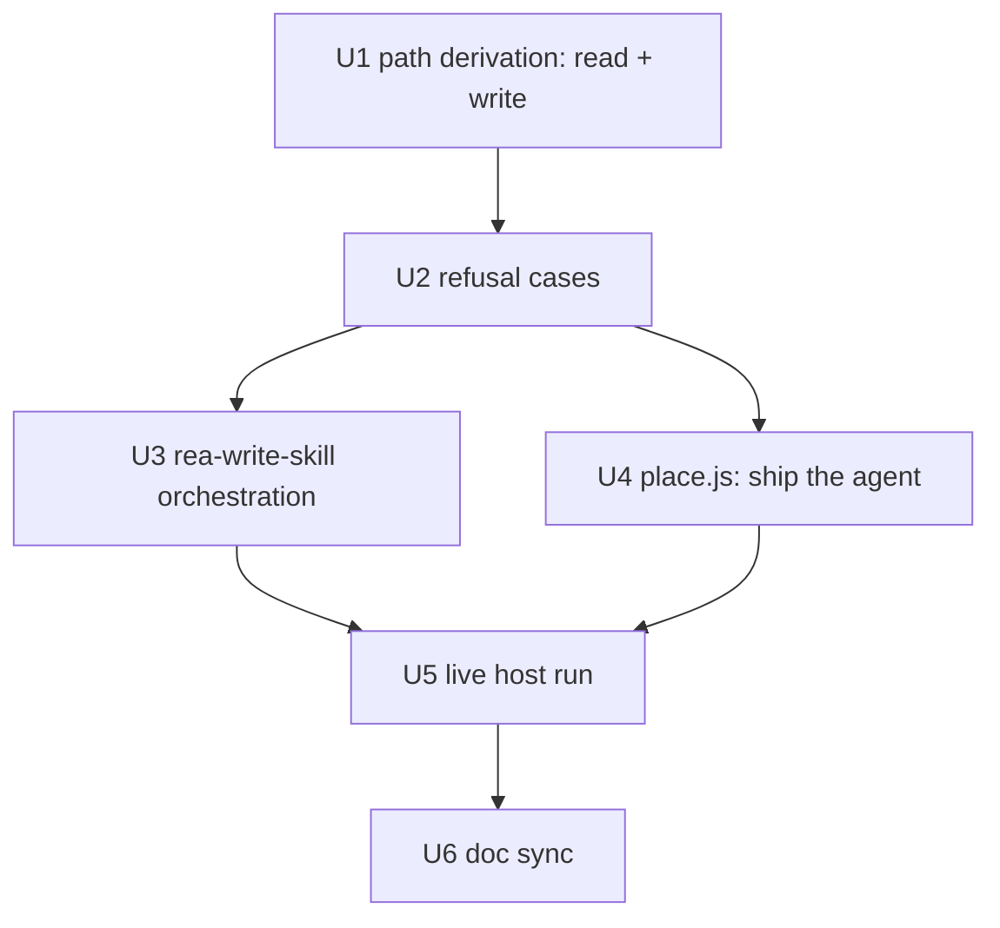

# Plan: skill-writer for the host audience

The agent must be correct before it ships, so U4 (removing the placement exclusion) depends on the
prompt work rather than running beside it. U1 and U2 both edit `skill-writer.md` — path resolution
first, refusal cases on top of it — so they are sequential, not parallel. U5 is the unit that
actually invokes the agent; the plan exists because nobody did that before.

| Unit | Title | Depends on |
|------|-------|------------|
| U1 | Two-mode path derivation in `skill-writer` (write path and read path) | — |
| U2 | Refusal cases in `skill-writer` | U1 |
| U3 | `rea-write-skill` orchestration matches the new agent behaviour | U2 |
| U4 | Ship the agent: drop the placement exclusion, invert its tests | U2 |
| U5 | Live host run: exercise the agent, not just the installer | U3, U4 |
| U6 | Doc sync | U5 |

