# REA

A portable development toolkit that bootstraps a structured Claude Code workflow into any project.


```bash
pip install rea-dev
rea init <project>          # copies slash commands + agents + creates .rea/ dirs
# open Claude Code → /rea-init
```

---

## The problem

Claude Code is powerful but stateless. Each session starts cold: no memory of past decisions, no consistent workflow, no plan files, no branch discipline. You rebuild context every time.

REA solves this by giving Claude a fixed structure to operate inside — the same commands, the same plan format, the same branch rules — across every project and every session.

---

## What it does

REA installs slash commands, composable agents, and a structured plan/log system into your project. The CLI is mechanical — it copies files. All intelligence runs through Claude.

### Commands

```
rea init             → copies .claude/commands/ + .claude/agents/ + creates .rea/
/rea-init            → scans project, installs missing config, sets up GitHub
/rea-plan            → full planning pipeline with interrogation + adversarial review
/rea-execute         → agent-driven implementation with parallel dispatch
/rea-commit          → detects branch, opens PR to correct target
/rea-verify          → health check, reports missing pieces with fix commands
/rea-brainstorm      → collaborative design exploration before planning
/rea-update          → update REA from PyPI + sync templates
/rea-wrap            → session wrap-up — log, lessons, context for next session
/rea-worktree        → isolated git worktree for parallel work
/rea-write-skill     → create new agents or commands
```

### Agents

Agents are composable building blocks that commands orchestrate. Each agent has a single responsibility and can also be called standalone.

| Agent | Model | Purpose |
|-------|-------|---------|
| `explorer` | Haiku | Read-only codebase research |
| `implementer` | Sonnet | TDD-driven implementation (RED-GREEN-REFACTOR) |
| `spec-reviewer` | Sonnet | Verifies implementation matches requirements |
| `code-reviewer` | Sonnet | Code quality assessment (SRP, DRY, testability) |
| `debugger` | Sonnet | 4-phase root cause debugging |
| `plan-reviewer` | Sonnet | Adversarial plan review — finds gaps before execution |
| `plan-validator` | Sonnet | Mechanical plan checks — rules, file placement, coverage |
| `dispatcher` | Sonnet | Groups todo items into parallel/sequential batches |
| `bug-scanner` | Sonnet | Logic bugs, edge cases, error handling gaps |
| `security-scanner` | Sonnet | Security vulnerabilities, OWASP top 10 |
| `skill-writer` | Sonnet | Creates new agents or commands matching REA conventions |

---

## Quickstart

**Requirements:** Python 3.11+, `gh` CLI authenticated (with `workflow` scope), git repo with GitHub remote.

```bash
# 1. Install
pip install rea-dev

# 2. Add REA to your project
rea init /path/to/project

# 3. Open Claude Code in that project and run
/rea-init
```

`/rea-init` detects your stack (Node/pnpm, Python, etc.) and installs:
- `.claude/settings.json` — allowed commands
- `.claude/hooks/post-tool-use.sh` — auto-lint on every file write
- `.github/workflows/ci.yml` — test + lint on every PR
- `.github/workflows/claude-review.yml` — `@claude` PR review via Anthropic API
- `.gitattributes` — consistent line endings across platforms
- `staging` branch + GitHub branch protection

Required GitHub secrets after setup:
```bash
gh secret set ANTHROPIC_API_KEY
gh secret set COOLIFY_STAGING_WEBHOOK_URL    # if using Coolify
gh secret set COOLIFY_PRODUCTION_WEBHOOK_URL # if using Coolify
```

---

## Plan pipeline

The most important part of REA. Before writing any code, you run:

```
/rea-plan "add stripe billing"
```

Claude doesn't immediately start coding. It:

1. Researches the relevant files and functions in your project
2. Drafts a technical requirements doc — no code, no PM sections
3. Runs an interrogation loop: *"100% sure this plan is right?"* — finds real problems before they hit production
4. Surfaces decisions with trade-offs and waits for your input
5. Runs **adversarial review** via `plan-reviewer` agent — catches gaps, inconsistencies, and unresolved decisions
6. Writes three files to `.rea/plans/0001-stripe-billing/`:
   - `spec.md` — what and why
   - `plan.md` — technical requirements
   - `todo.md` — step-by-step execution with a `NEXT:` marker
7. Creates a log entry in `.rea/log/`

The `NEXT:` marker in `todo.md` marks the first incomplete step. Next session, `/rea-plan` finds it and asks to resume — no re-reading the full plan.

---

## Execution pipeline

After planning, run:

```
/rea-execute
```

The execution pipeline:

1. Loads the active plan and todo list
2. Calls `dispatcher` agent to analyze dependencies and group items into parallel/sequential batches
3. Executes items using `implementer` agent (with TDD: write test → make it pass → refactor)
4. Runs `spec-reviewer` and `code-reviewer` after each batch
5. Loops until all items are complete
6. Detects recurring patterns and suggests new skills via `skill-writer`

---

## Plan file structure

```
.rea/
├── log/
│   └── 2026-03-14-0001-stripe-billing.md
└── plans/
    └── 0001-stripe-billing/
        ├── spec.md    ← what and why
        ├── plan.md    ← technical requirements
        └── todo.md    ← step-by-step with NEXT: marker
```

---

## Branch strategy

```
main      → production
staging   → pre-production
feature/* → PR to staging
hotfix/*  → PR to main
```

`/rea-commit` detects the current branch and opens the PR to the right target automatically.

---

## CLAUDE.md hierarchy

```
~/.claude/CLAUDE.md           ← global rules (all projects)
project/CLAUDE.md             ← project architecture + stack
project/features/x/CLAUDE.md ← feature-specific rules (created by /rea-plan when needed)
```

`/rea-plan` creates a feature-level `CLAUDE.md` when the task opens a new domain (auth, billing, webhooks) or spans multiple sessions.

---

## REA vs Superpowers

[Superpowers](https://github.com/obra/superpowers) is a popular Claude Code plugin that enforces TDD and structured debugging. REA takes a different approach — modular agents and a full project lifecycle.

| Capability | REA | Superpowers |
|---|---|---|
| TDD (red-green-refactor) | Risk-based — mandatory for high-risk, optional for low-risk | Always mandatory |
| Debugging methodology | 4-phase root cause agent (`debugger`) | 4-phase structured debugging |
| Brainstorming | `/rea-brainstorm` → spec → handoff to plan | Socratic brainstorming |
| Planning pipeline | Interrogation loop + adversarial review (`plan-reviewer`) | — |
| Parallel execution | `dispatcher` groups items → concurrent `implementer` agents | — |
| Code review | `code-reviewer` agent with delta coverage check | Built-in code review |
| Spec review | `spec-reviewer` — verifies impl matches requirements | — |
| Self-extending | `/rea-write-skill` — creates new agents/commands | Skill authoring |
| Git worktrees | `/rea-worktree` — isolated parallel branches | — |
| Branch strategy | `feature/*` → staging → main with auto PR targeting | — |
| CI/CD setup | `/rea-init` installs workflows, branch protection, hooks | — |
| Plan persistence | `.rea/plans/` with spec + plan + todo, cross-session resume | — |
| Installation | `pip install` + `rea init` (CLI) | Plugin marketplace |
| Test coverage target | Delta coverage — new code must have tests | 85-95% target |

**TL;DR:** Superpowers focuses on coding discipline (TDD, debugging). REA covers the full lifecycle — from brainstorming through planning, execution, review, and deployment.

---

## Architecture

```
Commands (orchestrators)          Agents (building blocks)
┌─────────────────────┐          ┌──────────────────────┐
│ /rea-plan           │───calls──│ explorer             │
│                     │───calls──│ plan-reviewer         │
│ /rea-execute        │───calls──│ dispatcher            │
│                     │───calls──│ implementer           │
│                     │───calls──│ spec-reviewer         │
│                     │───calls──│ code-reviewer         │
│                     │───calls──│ skill-writer          │
│ /rea-brainstorm     │───calls──│ explorer             │
│ /rea-write-skill    │───calls──│ skill-writer          │
└─────────────────────┘          └──────────────────────┘

```

Key rule: **agents never call other agents** — only commands orchestrate agent calls.

---

## Flowchart

```mermaid
flowchart TD
    A([Developer]) --> B["pip install rea (one time)"]
    B --> C["rea init — copies commands + creates .rea/"]
    C --> D["Open Claude Code"]
    D --> E["/rea-init"]

    %% INIT
    E --> F{"gh CLI auth OK?"}
    F -->|No| G["Run gh auth login, then retry"]
    F -->|Yes| H{CLAUDE.md exists?}
    H -->|"No — Greenfield"| I["Ask questions, generate CLAUDE.md"]
    H -->|"Yes — Brownfield"| J["Scan existing structure, detect missing"]
    I --> K[Install missing files]
    J --> K
    K --> L[".claude/settings.json + hooks + .github/workflows/"]
    L --> M["Create staging branch"]
    M --> N["Set up GitHub branch protection"]
    N --> O["/rea-verify"]
    O --> P{Issues found?}
    P -->|Yes| Q["Report issues with fix commands"]
    Q --> O
    P -->|No| R([Project ready])

    %% PLAN PIPELINE
    R --> S["/rea-plan — describe task"]
    S --> S0{"NEXT: marker found?"}
    S0 -->|Yes| S1["Ask: resume or new plan?"]
    S1 -->|Resume| AG
    S1 -->|New| T
    S0 -->|No| T
    T[Draft plan]
    T --> U{"100% sure?"}
    U -->|No| V[Find real problems]
    V --> W{"Sure about the problems?"}
    W -->|No| X[Find root problems]
    X --> Y{"Sure now?"}
    Y -->|No| X
    Y -->|Yes| Z[List solutions]
    U -->|Yes| Z
    W -->|Yes| Z
    Z --> AA{Decision needed?}
    AA -->|Yes| AB["Explain trade-offs, you decide"]
    AB --> AC[Lock plan]
    AA -->|No| AC
    AC --> AD["Adversarial review via plan-reviewer"]
    AD --> AD2{Review passed?}
    AD2 -->|No| T
    AD2 -->|Yes| AE0[".rea/plans/NNNN-task/ spec+plan+todo, update log"]
    AE0 --> AE{"New domain? Complex? Multi-session?"}
    AE -->|Yes| AF["Create features/x/CLAUDE.md"]
    AE -->|No| AG
    AF --> AG

    %% EXECUTE PIPELINE
    AG["/rea-execute"] --> AG1["dispatcher groups todo into batches"]
    AG1 --> AG2["Parallel batch: run implementers concurrently"]
    AG2 --> AG3["Sequential batch: run one at a time"]
    AG3 --> AG4["spec-reviewer + code-reviewer after each batch"]
    AG4 --> AG5{All items done?}
    AG5 -->|No| AG2
    AG5 -->|Yes| AH["Pattern detection → suggest new skills"]
    AH --> AI["/rea-commit"]
    AI --> AJ{Current branch?}
    AJ -->|"feature/*"| AK["Open PR → staging"]
    AJ -->|"hotfix/*"| AL["Open PR → main"]

    %% CI/CD
    AK --> AM["CI: test + lint"]
    AL --> AM
    AM --> AN{CI passed?}
    AN -->|No| AO["@claude why did CI fail, fix it"]
    AO --> AM
    AN -->|Yes| AP["@claude review"]
    AP --> AQ{Review passed?}
    AQ -->|No| AR[Apply feedback]
    AR --> AG
    AQ -->|Yes| AS{Target branch?}
    AS -->|staging| AT["Merge to staging — deploy to staging"]
    AS -->|main| AU["Merge to main — deploy to production"]
    AT --> AV["Test on staging"]
    AV --> AW{OK?}
    AW -->|No| AX[Bug fix]
    AX --> AG
    AW -->|Yes| AY["Open PR → main"]
    AY --> AU

    %% SELF IMPROVEMENT
    AU --> AZ{Lesson learned?}
    AZ -->|Universal| BA["Update ~/.claude/CLAUDE.md — you approve"]
    AZ -->|Project-specific| BB["Update project/CLAUDE.md"]
    BA --> BC([Next project starts smarter])
    BB --> BC
```



---

## License

MIT
