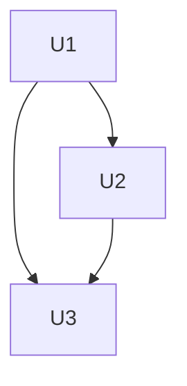

# REA Schema — the `.rea/` format spec

This is the tool-agnostic on-disk format spec for `.rea/`: the directory layout, the naming and
collision rules per note type, and the exact templates for `plan.md` and `todo.md`. It is written
as **markdown, not JSON Schema** — agents read markdown directly, and every rule below is phrased
so it is regex-checkable (a fixed heading shape, a fixed field name) rather than requiring a
schema validator. Both `rea-tools` and `rea-cli` read and write to this same spec — neither owns a
private variant.

_This document also covers the root-level shim write contract (for files like `AGENTS.md` /
`CLAUDE.md` that live outside `.rea/`) and the capture note formats, numbering, wikilinks, and
version-bump policy — those sections are appended after this one._

---

## Directory layout

```
.rea/
├── knowledge/   # semantic — what we know. 1 note per entity (module / gotcha / concept)
├── decisions/   # ADRs — why. Numbered: 0001-<slug>.md, 0002-…
├── sessions/    # episodic — what happened, when. Timestamped: YYYY-MM-DD-HHMM-<slug>.md
└── plans/       # active work. Numbered dirs: 0001-<slug>/{brief,spec,plan,todo}.md
```

- **`knowledge/`** — one file per entity (a module, a gotcha, a concept). Filename is the entity
  name.
- **`decisions/`** — one file per ADR (architecture decision record). Filename is `NNNN-<slug>.md`,
  numbered sequentially.
- **`sessions/`** — one file per work session. Filename is `YYYY-MM-DD-HHMM-<slug>.md`, timestamped.
- **`plans/`** — one directory per unit of planned work, `NNNN-<slug>/`, holding up to four files:
  `brief.md`, `spec.md`, `plan.md`, `todo.md`.

---

## Per-note-type naming & collision

Each note type has one naming rule and one collision behavior. Do not mix them across types.

### `knowledge/` — entity-name, update-in-place

- Filename = the entity's stable name (e.g. `knowledge/mover-capture.md`). The name is the address
  other notes link to.
- **Update-in-place:** writing to an existing entity overwrites/extends that same file — there is
  no versioning or append for knowledge notes. This keeps lookups cheap: no dedup search needed to
  find "the" note for an entity.
- **Collision guard:** before writing `knowledge/<entity>.md`, if the file already exists, read it
  first to confirm it describes the *same* entity. If a *different* concept collides on the same
  name, disambiguate the new note's filename (e.g. `mover-capture-2.md`, or a more specific name)
  rather than overwriting. One read, only on collision — not a read-before-every-write rule.

### `decisions/` — numbered, append-only

- Filename = `NNNN-<slug>.md`, numbered sequentially as decisions are recorded.
- **Append-only:** a new decision is always a new file. An existing decision is never edited to
  change its outcome.
- **Supersede, never overwrite:** if a later decision replaces an earlier one, write a new
  `NNNN-<slug>.md` that says it supersedes the old one (and the old one is marked superseded) — the
  old file is never mutated to reflect the new answer. The decision history stays intact.

### `sessions/` — timestamped

- Filename = `YYYY-MM-DD-HHMM-<slug>.md`. The timestamp makes the filename naturally unique — no
  collision guard is needed for this type.

---

## `plan.md` format

`plan.md` is the **dependency graph only** — it does not restate any per-unit detail that lives in
`todo.md` (see below). It is a single table:

```
| Unit | Title | Depends on |
|------|-------|------------|
```

- **`Unit`** — the unit-id, matching the `U<n>` used in the corresponding `todo.md` heading. This
  is the **join key** between `plan.md` and `todo.md`.
- **`Title`** — a short human-readable title for the unit (matches the todo heading's title).
- **`Depends on`** — the unit-ids this unit is blocked on, comma-separated, or `—` if none. **This
  field lives only in `plan.md`** — it is never restated in `todo.md`.

An optional Mermaid graph may follow the table for visual review; the table is the
source of truth, the diagram is a rendering of it.

### Example

```markdown
| Unit | Title                          | Depends on |
|------|--------------------------------|------------|
| U1   | Set up project scaffolding     | —          |
| U2   | Add authentication middleware  | U1         |
| U3   | Wire login UI to auth API      | U1, U2     |
```



---

## `todo.md` format

`todo.md` holds the **detail** for every unit named in `plan.md`, one section per unit. Each
section starts with a fixed, regex-checkable heading:

```
### U<n> — <title>
```

(pattern: `^### U(\d+) — (.+)$` — the captured number is the unit-id, the captured text is the
title). The unit-id in this heading is the same join key used in `plan.md`'s `Unit` column; the
title should match `plan.md`'s `Title` column for the same unit.

Under the heading, exactly four fields, each on its own line, in this order:

- **`Files:`** — the file(s) this unit is expected to touch.
- **`Done when:`** — the concrete, checkable completion condition for this unit.
- **`Size:`** — how big the unit is (e.g. in smart-zones — see `core/principles.md` principle H).
- **`Status:`** — one of `todo`, `in-progress`, `done`, `blocked` (see below).

**These four fields live only in `todo.md`.** `Depends on` is never restated here — it lives only
in `plan.md`. Each field lives in exactly one place; nothing is duplicated between the two files.

### Example

```markdown
### U3 — Wire login UI to auth API

Files: `src/ui/Login.tsx`, `src/api/auth.ts`
Done when: the login form submits credentials, receives a token from the auth API, and redirects
  on success; a test covering the token exchange exists and passes.
Size: 1 smart-zone
Status: todo
```

---

## Unit status & computed frontier

Each unit's `Status:` field in `todo.md` is the **single source of truth** for its progress. There
is no separate scalar pointer (no `NEXT`) — progress is read entirely from the per-unit statuses.

**Status lifecycle:**

- `todo` — not started; eligible to run once its dependencies are done.
- `in-progress` — currently being worked.
- `done` — finished and committed.
- `blocked` — cannot proceed (a decision or an external blocker); needs a human.

Transitions: `todo → in-progress → done` (the normal path), or `todo → in-progress → blocked` when
work stalls on something that needs a human.

**Frontier (computed, not stored):** the frontier is the set of units that can run right now. It is
recomputed every run, never persisted:

> **Frontier** = every unit where `Status: todo` **and** every unit listed in its `plan.md`
> `Depends on` has `Status: done`.

A unit with no `Depends on` (`—`) is in the frontier as soon as its own `Status` is `todo`.

**Resume:** resuming work re-runs the frontier computation from scratch — it does not read or trust
any leftover "next unit" pointer. Any unit left `in-progress` from a session that did not finish
cleanly is **re-verified** before the frontier is computed: if a commit for that unit exists, its
`Status` is corrected to `done`; if no commit exists, its `Status` is reset to `todo` so it re-enters
the frontier.

---

## Numbering

`plans/` and `decisions/` are the two note types that use a numbered `NNNN-<slug>` filename (see
Directory layout above). The numbering rule is the same for both:

- **Uniqueness comes from the slug, not the number.** The number is a rough chronological hint, not
  a unique key. Two parallel branches that both mint `0007-<slug>` (e.g. `0007-auth` on one branch,
  `0007-cache` on another) land in different files/dirs and **merge cleanly** — the slugs differ, so
  there is no collision, even though the numbers match.
- **No central index file.** There is no manifest of "which number is taken" to keep in sync — that
  file would itself be the merge-conflict point this rule is designed to avoid. The directory listing
  *is* the index: `ls .rea/decisions/` or `ls .rea/plans/` is always accurate, always mergeable.
- **Duplicate numbers are cosmetic.** It is fine, temporarily, for two files to share a leading
  number. This is not an error state — it is renumbered occasionally by `rea-tidy` (housekeeping,
  human-reviewed), not treated as data loss or corruption.

---

## Shim write semantics

_This section is the root-file shim contract referenced in this document's intro: it governs how
`rea-tools` writes to files that live **outside** `.rea/` — the tool shims (`AGENTS.md`, `CLAUDE.md`,
`GEMINI.md`) and Gemini's `settings.json`. It is part of this schema spec because, like the `.rea/`
formats above, both `rea-tools` and `rea-cli` must write these files the same way._

The one rule that governs every shim write: **never blind-overwrite.** A shim file may contain user
content that was never written by `rea-tools`; a naive overwrite would destroy it. Two write
strategies follow from this, one per file format:

- **Markdown shims** (`AGENTS.md`, `CLAUDE.md`, `GEMINI.md`) are written **inside managed markers**:

  ```
  <!-- rea-tools:start -->
  ...rea-tools-owned content...
  <!-- rea-tools:end -->
  ```

  A re-init (or update) replaces **only** the content between these markers. Anything a user wrote
  outside the markers — above, below, or interleaved across sessions — is preserved untouched.

- **JSON shims** (Gemini's `settings.json`) use a **structured read-modify-write merge**: read the
  existing file, add or update only the keys `rea-tools` requires, and leave every other key as
  found. There is no managed-marker equivalent for JSON — the merge is field-by-field instead of a
  block replace.

Ownership of which files (and which regions of them) belong to `rea-tools` is tracked in a
per-project manifest written by the installer; `rea-tidy` reconciles any drift between the manifest
and what is actually on disk. This manifest is what makes it safe for the installer to prune files it
previously owned without ever touching a file — or a byte range — it doesn't own.

---

## Capture note format

This section specifies the **fields only** — the minimal, provisional shape a capture-written note
takes per type. It does not specify *when* a note should be captured, or *what qualifies* as worth
capturing — that write-filter behavior is a rule that lives in `AGENTS.md` (authored in a later
phase), not in this schema document.

Provisional fields per type (extend once `capture` ships and real usage shows what's missing):

- **`knowledge/`** — `name`, `description`, `type`, `links`.
- **`decisions/`** — `number`, `date`, `status`, `superseded-by`.
- **`sessions/`** — `date`, `summary`, `links`.

---

## Wikilinks

- **Bare entity names resolve directly.** `knowledge/`, `decisions/`, and `sessions/` filenames are
  unique across the store (see Numbering and Per-note-type naming & collision above), so a link like
  `[[mover-capture]]` resolves without ambiguity.
- **Path-qualified inside `plans/*/`.** Filenames repeat across plan directories — every plan has its
  own `plan.md`, `spec.md`, `todo.md`, `brief.md` — so a bare `[[plan]]` would be ambiguous. Links
  into a specific plan's files must be path-qualified: `[[plans/0003-x/plan]]`.

---

## Versioning

This document's frontmatter carries a `schema-version` stamp (currently `0.1`), tracking the shape of
everything defined above — directory layout, naming/collision rules, `plan.md`/`todo.md` formats,
status/frontier semantics, numbering, shim write semantics, capture note fields, and wikilink
resolution.

**Bump policy:**

- **Minor** version bump for an additive change — a new field, a new note type, a new rule that
  doesn't invalidate anything already on disk.
- **Major** version bump for a breaking change — renaming or removing a field, a note type, or a rule
  in a way that makes existing `.rea/` content non-conformant.

Once packaging exists, consumers (`rea-cli`) pin the schema version they support against this stamp.
