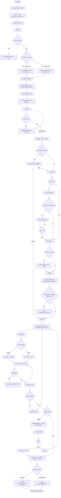

# REA — Flowchart

```mermaid
flowchart TD
    A([Developer]) --> B["pip install rea (one time)"]
    B --> C["rea init — copies commands + creates .rea/"]
    C --> D["Open Claude Code"]
    D --> E["/rea-init"]

    %% INIT
    E --> F{"gh CLI auth OK?"}
    F -->|No| G["Run gh auth login, then retry"]
    F -->|Yes| H{CLAUDE.md exists?}
    H -->|"No — Greenfield"| I["Ask questions, generate CLAUDE.md"]
    H -->|"Yes — Brownfield"| J["Scan existing structure, detect missing"]
    I --> K[Install missing files]
    J --> K
    K --> L[".claude/settings.json + hooks + .github/workflows/"]
    L --> M["Create staging branch"]
    M --> N["Set up GitHub branch protection"]
    N --> O["/rea-verify"]
    O --> P{Issues found?}
    P -->|Yes| Q["Report issues with fix commands"]
    Q --> O
    P -->|No| R([Project ready])

    %% PLAN PIPELINE
    R --> S["/rea-plan — describe task"]
    S --> S0{"NEXT: marker found?"}
    S0 -->|Yes| S1["Ask: resume or new plan?"]
    S1 -->|Resume| AG
    S1 -->|New| T
    S0 -->|No| T
    T[Draft plan]
    T --> U{"100% sure?"}
    U -->|No| V[Find real problems]
    V --> W{"Sure about the problems?"}
    W -->|No| X[Find root problems]
    X --> Y{"Sure now?"}
    Y -->|No| X
    Y -->|Yes| Z[List solutions]
    U -->|Yes| Z
    W -->|Yes| Z
    Z --> AA{Decision needed?}
    AA -->|Yes| AB["Explain trade-offs, you decide"]
    AB --> AC[Lock plan]
    AA -->|No| AC
    AC --> AD[".rea/plans/NNNN-task/ spec+plan+todo, update log"]
    AD --> AE{"New domain? Complex? Multi-session?"}
    AE -->|Yes| AF["Create features/x/CLAUDE.md"]
    AE -->|No| AG
    AF --> AG[Execute]

    %% EXECUTE PIPELINE
    AG --> AH["Follow todo step by step — no questions, no discussion"]
    AH --> AI["/rea-commit"]
    AI --> AJ{Current branch?}
    AJ -->|"feature/*"| AK["Open PR → staging"]
    AJ -->|"hotfix/*"| AL["Open PR → main"]

    %% CI/CD
    AK --> AM["CI: test + typecheck + lint"]
    AL --> AM
    AM --> AN{CI passed?}
    AN -->|No| AO["@claude why did CI fail, fix it"]
    AO --> AM
    AN -->|Yes| AP["@claude review"]
    AP --> AQ{Review passed?}
    AQ -->|No| AR[Apply feedback]
    AR --> AH
    AQ -->|Yes| AS{Target branch?}
    AS -->|staging| AT["Merge to staging — Coolify staging deploy"]
    AS -->|main| AU["Merge to main — Coolify production deploy"]
    AT --> AV["Test on staging"]
    AV --> AW{OK?}
    AW -->|No| AX[Bug fix]
    AX --> AH
    AW -->|Yes| AY["Open PR → main"]
    AY --> AU

    %% SELF IMPROVEMENT
    AU --> AZ{Lesson learned?}
    AZ -->|Universal| BA["Update ~/.claude/CLAUDE.md — you approve"]
    AZ -->|Project-specific| BB["Update project/CLAUDE.md"]
    BA --> BC([Next project starts smarter])
    BB --> BC
```
