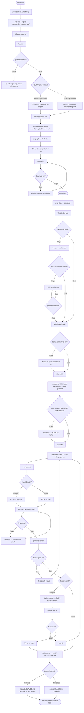

# REA — Flowchart

```mermaid
flowchart TD
    A([Developer]) --> B["pip install rea (one time)"]
    B --> C["rea init — copies commands + creates .rea/"]
    C --> D["Claude Code aç"]
    D --> E["/rea-init"]

    %% INIT
    E --> F{"gh CLI auth OK?"}
    F -->|Hayır| G["gh auth login yap, sonra tekrar dene"]
    F -->|Evet| H{CLAUDE.md var mı?}
    H -->|"Hayır — Greenfield"| I["Sorular sor, CLAUDE.md oluştur"]
    H -->|"Evet — Brownfield"| J["Mevcut yapıyı tara, eksikleri tespit et"]
    I --> K[Eksik dosyaları kur]
    J --> K
    K --> L[".claude/settings.json + hooks + .github/workflows/"]
    L --> M["staging branch oluştur"]
    M --> N["GitHub branch protection kur"]
    N --> O["/rea-verify"]
    O --> P{Sorun var mı?}
    P -->|Evet| Q["Eksikleri raporla, sen düzelt"]
    Q --> O
    P -->|Hayır| R([Proje hazır])

    %% PLAN PIPELINE
    R --> S["/rea-plan — task anlat"]
    S --> T[Taslak plan üret]
    T --> U{"100% emin misin?"}
    U -->|Hayır| V[Gerçek sorunları bul]
    V --> W{"Sorunlardan emin misin?"}
    W -->|Hayır| X[Kök sorunları bul]
    X --> Y{"Şimdi emin misin?"}
    Y -->|Hayır| X
    Y -->|Evet| Z[Çözümleri listele]
    U -->|Evet| Z
    W -->|Evet| Z
    Z --> AA{Karar gereken var mı?}
    AA -->|Evet| AB["Trade-off açıkla, sen karar ver"]
    AB --> AC[Plan kilitle]
    AA -->|Hayır| AC
    AC --> AD[".rea/plans/NNNN-task/ spec+plan+todo, log güncelle"]
    AD --> AE{"Yeni domain? Karmaşık? Çok session?"}
    AE -->|Evet| AF["features/x/CLAUDE.md oluştur"]
    AE -->|Hayır| AG
    AF --> AG[Execute]

    %% EXECUTE PIPELINE
    AG --> AH["todo adım adım — soru yok, yorum yok"]
    AH --> AI["/rea-commit"]
    AI --> AJ{Hangi branch?}
    AJ -->|"feature/*"| AK["PR aç → staging"]
    AJ -->|"hotfix/*"| AL["PR aç → main"]

    %% CI/CD
    AK --> AM["CI: test + typecheck + lint"]
    AL --> AM
    AM --> AN{CI geçti mi?}
    AN -->|Hayır| AO["@claude CI neden kırıldı, düzelt"]
    AO --> AM
    AN -->|Evet| AP["@claude review"]
    AP --> AQ{Review geçti mi?}
    AQ -->|Hayır| AR[Feedback uygula]
    AR --> AH
    AQ -->|Evet| AS{Hedef branch?}
    AS -->|staging| AT["staging merge — Coolify staging deploy"]
    AS -->|main| AU["main merge — Coolify production deploy"]
    AT --> AV["Staging test et"]
    AV --> AW{Tamam mı?}
    AW -->|Hayır| AX[Bug fix]
    AX --> AH
    AW -->|Evet| AY["PR aç → main"]
    AY --> AU

    %% SELF IMPROVEMENT
    AU --> AZ{Lesson learned?}
    AZ -->|Evrensel| BA["~/.claude/CLAUDE.md güncelle — sen onayla"]
    AZ -->|"Proje özel"| BB["project/CLAUDE.md güncelle"]
    BA --> BC([Sonraki projede daha az hata])
    BB --> BC
```
